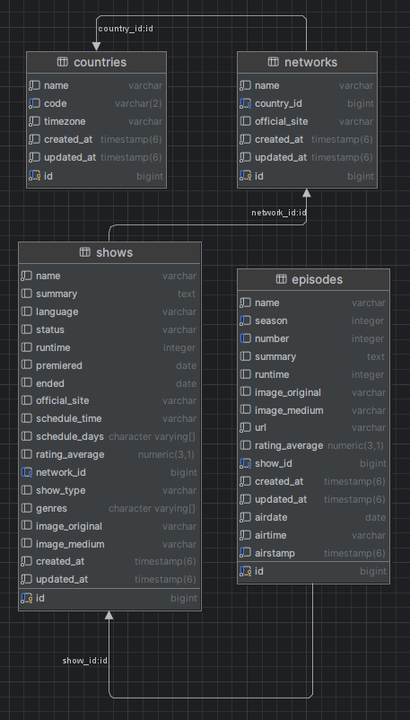

## Requirements

* Ruby 3.1.2
* PostgreSQL

## Setup

1. Install the gems

```
bundle install
```

2. Create and setup the database

```
rails db:create
rails db:migrate
```

3. Run tests

```
rspec
```

## DB Indexes

Apart from ID/FK indexes, it was added indexes related to the attributes that 
are used in the endpoint filters.
- Episodes (airstamp)
- Networks (name)
- Countries (code)

## DB schema



## Final considerations / TODO

- `TvshowsController` would benefit of moving things to separate files, like the filter queries
- Store the optional `webChannel` from `tvmaze` response (there are shows without a network)
- Treat rate limiting: API calls are rate limited to allow at least 20 calls every 10 seconds per IP address. (didn't happen anytime during development)
- Provide at least 3 sample analytical queries (CTE/window or aggregate).
- Deployment plan
- Use Redis for cache
- Create a presenter for the episode Json
- `Schedule.upsert!` might need to delete data before fetching data from date (in case schedule changes)
- Cache data from country/network in episodes to avoid joining the tables for filter
- Filter by network name should not be an exact match only
- Add rating filter
